# NYTimes Bestseller AI Reporter

Data-driven reporting tool built on the **New York Times Books API** that transforms live bestseller data into structured, interactive insights and AI-generated trend reports. The application retrieves real-time book rankings, author information, and publishing trends, displays them through a pastel-pink Shiny dashboard, and uses AI to generate weekly bestseller briefings — all presented on a paper-styled report page with PDF export.

---

## Features

| Component | Description |
|---|---|
| **API Integration** | Queries the NYT Books API for current bestseller lists and book data across all categories |
| **Web Interface** | Interactive R/Shiny dashboard with list filtering, multi-column sorting, recommendations table, and a top-10 weeks-on-list bar chart — in a pastel candy-pink theme |
| **AI Reporting** | Generates emoji-rich trend analysis reports via **Ollama Cloud**, **Ollama Local**, or **OpenAI** — displayed on a paper-styled page with a pie chart of books by category |
| **PDF Export** | One-click download of the AI-generated report as a formatted PDF |

---

## System Architecture

```mermaid
flowchart TD
    subgraph FETCH ["🌸 1 · Data Fetching"]
        A["🔑 NYT API Key"] -->|authenticates| B["📡 fetch_bestsellers.py"]
        B -->|GET /lists/overview.json\nGET /lists/current/| C[("🗄️ data/bestsellers.json")]
    end

    subgraph DASH ["🌷 2 · Bestseller Dashboard — app.R Tab 1"]
        D["📂 Load cached JSON"] --> E["🎯 Filter & Sort"]
        E --> F["📖 Recommendations\nTable"]
        E --> G["📈 Top-10 Weeks\nBar Chart"]
    end

    subgraph AI ["🌺 3 · AI Report — app.R Tab 2"]
        H["🔧 Summarize data"] --> I{"🤖 AI Backend"}
        I -->|OLLAMA_API_KEY| J["☁️ Ollama Cloud\ngemma3:4b"]
        I -->|OPENAI_API_KEY| K["☁️ OpenAI\ngpt-4o-mini"]
        I -->|localhost| L["💻 Ollama Local\nsmollm2:1.7b"]
        J --> M["📝 Trend Report\non Paper Page"]
        K --> M
        L --> M
        M --> N["🍰 Pie Chart\nBooks by Category"]
        M --> O["📄 Export PDF"]
    end

    C --> D
    C --> H

    style FETCH fill:#FADADD,stroke:#D1729B,stroke-width:2px,color:#4A2040
    style DASH fill:#F9E4EC,stroke:#E8A0BF,stroke-width:2px,color:#4A2040
    style AI fill:#F4B8D0,stroke:#D1729B,stroke-width:2px,color:#4A2040
    style A fill:#fff,stroke:#D1729B,color:#7A2D50
    style B fill:#fff,stroke:#D1729B,color:#7A2D50
    style C fill:#fff,stroke:#9B3D6E,color:#7A2D50,stroke-width:2px
    style D fill:#fff,stroke:#E8A0BF,color:#7A2D50
    style E fill:#fff,stroke:#E8A0BF,color:#7A2D50
    style F fill:#fff,stroke:#E8A0BF,color:#7A2D50
    style G fill:#fff,stroke:#E8A0BF,color:#7A2D50
    style H fill:#fff,stroke:#D1729B,color:#7A2D50
    style I fill:#FADADD,stroke:#D1729B,color:#7A2D50
    style J fill:#fff,stroke:#D1729B,color:#7A2D50
    style K fill:#fff,stroke:#D1729B,color:#7A2D50
    style L fill:#fff,stroke:#D1729B,color:#7A2D50
    style M fill:#fff,stroke:#9B3D6E,color:#7A2D50,stroke-width:2px
    style N fill:#fff,stroke:#E8A0BF,color:#7A2D50
    style O fill:#fff,stroke:#E8A0BF,color:#7A2D50
```



---

## Data Summary

The NYT Books API returns bestseller data structured as follows. After processing, each book record contains these columns:

| Column | Type | Description |
|---|---|---|
| `rank` | integer | Current rank on the bestseller list (1 = #1) |
| `title` | string | Book title |
| `author` | string | Author name(s) |
| `weeks_on_list` | integer | Number of consecutive weeks the book has appeared on this list |
| `description` | string | Brief synopsis of the book |
| `publisher` | string | Publishing house |
| `list_name` | string | Name of the NYT bestseller list (e.g., "Combined Print & E-Book Fiction") |
| `list_name_encoded` | string | URL-encoded list identifier used by the API |
| `book_image` | string | URL of the book cover image |
| `buy_links` | array | Links to purchase on Amazon, Apple Books, Barnes & Noble, etc. |
| `primary_isbn13` | string | 13-digit ISBN |
| `primary_isbn10` | string | 10-digit ISBN |

---

## File Structure

```
NYTimesBestsellerReporter/
├── app.R                  # Shiny app — dashboard + AI report tab (main entry point)
├── fetch_bestsellers.py   # Data fetcher — queries NYT API, saves to data/
├── ai_reporter.py         # Standalone AI reporter script (CLI)
├── requirements.txt       # Python dependencies
├── .env.example           # Template for API keys
├── .gitignore
├── README.md              # This file
└── data/
    └── bestsellers.json   # Cached bestseller data (generated by fetch_bestsellers.py)
```

---

## Technical Details

### API

- **API**: [NYT Books API v3](https://developer.nytimes.com/docs/books-product/1/overview)
- **Endpoints used**:
  - `GET /lists/overview.json` — all current bestseller lists with top books
  - `GET /lists/current/{list}.json` — full current list for a single category
  - `GET /lists/names.json` — list name metadata
- **Rate limit**: 500 requests/day (free tier). The fetch script adds a 1.5 s delay between requests.
- **API key**: Free — sign up at <https://developer.nytimes.com/get-started>

### AI Backend (choose one)

The software supports three AI backends. It auto-detects which to use based on which keys are present in `.env` (checked in priority order):

| Priority | Backend | Model | Requires |
|---|---|---|---|
| 1st | **OpenAI** (cloud) | `gpt-4o-mini` | `OPENAI_API_KEY` set in `.env` |
| 2nd | **Ollama Cloud** (cloud) | `gemma3:4b` (configurable) | `OLLAMA_API_KEY` set in `.env` |
| 3rd | **Ollama Local** (on your machine) | `smollm2:1.7b` (configurable) | Ollama installed and running locally (`ollama serve`) |

### R Packages

| Package | Purpose |
|---|---|
| `shiny` | Web application framework |
| `httr2` | HTTP requests (API + AI calls) |
| `jsonlite` | JSON parsing |
| `dplyr` | Data manipulation |
| `ggplot2` | Visualization (bar chart + pie chart) |
| `bslib` | Bootstrap theming |

### Python Packages

| Package | Purpose |
|---|---|
| `requests` | HTTP requests to NYT API and AI endpoints |
| `python-dotenv` | Load `.env` file |

---

## Usage Instructions

### 1. Clone the repository

```bash
git clone https://github.com/Kadambari-mirashi/NYTimesBestsellerReporter.git
cd NYTimesBestsellerReporter
```

### 2. Set up API keys

```bash
cp .env.example .env
# Edit .env and add your real NYT_API_KEY
# Add OLLAMA_API_KEY for Ollama Cloud, or OPENAI_API_KEY for OpenAI
```

### 3. Install dependencies

**Python** (for the data fetcher and standalone AI reporter):

```bash
pip install -r requirements.txt
```

**R** (for the Shiny app):

```r
install.packages(c("shiny", "httr2", "jsonlite", "dplyr", "ggplot2", "bslib"))
```

### 4. Fetch bestseller data

```bash
python fetch_bestsellers.py
```

This creates `data/bestsellers.json` with all current NYT bestseller data. The Shiny app loads this file on startup for fast, offline-capable browsing. A pre-fetched copy is included in the repo.

### 5. Run the Shiny app

```r
# From R console (working directory = project root)
shiny::runApp("app.R")
```

Or from the terminal:

```bash
Rscript -e 'shiny::runApp("app.R")'
```

The app opens in your browser with two tabs:

- **Bestseller Dashboard** — browse lists, filter/sort, view the recommendations table and a pink-gradient top-10 bar chart
- **AI Report** — click "Generate Report" to get an AI-powered trend briefing displayed on a paper-styled page, with a pie chart of books by category and a one-click PDF export

### 6. (Optional) Run the standalone AI reporter

```bash
python ai_reporter.py
```

This prints the AI-generated report to the terminal and saves it to `data/ai_report.txt`.

### AI Setup Notes

**Using Ollama Cloud (recommended — no local install needed)**:
1. Sign in at <https://ollama.com>
2. Go to Account Settings → API Keys → Generate a key
3. Add `OLLAMA_API_KEY=your_key_here` to your `.env` file

**Using Ollama Local (free, runs on your machine)**:
1. Install Ollama: <https://ollama.com>
2. Pull the model: `ollama pull smollm2:1.7b`
3. Start the server: `ollama serve`

**Using OpenAI (cloud)**:
1. Get an API key at <https://platform.openai.com/api-keys>
2. Add `OPENAI_API_KEY=sk-...` to your `.env` file

---

## License

Academic project for SYSEN 5381 — Cornell University.
